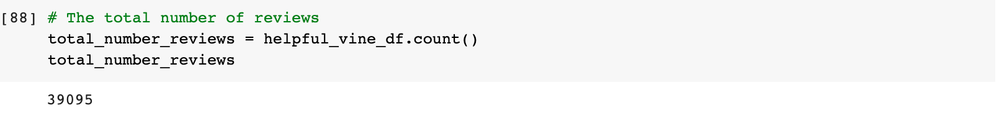
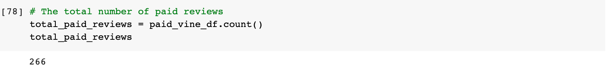
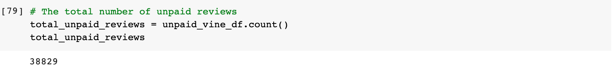
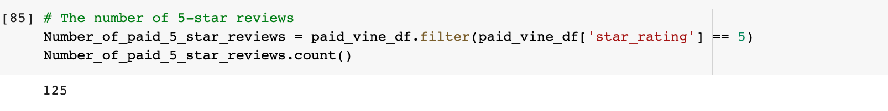
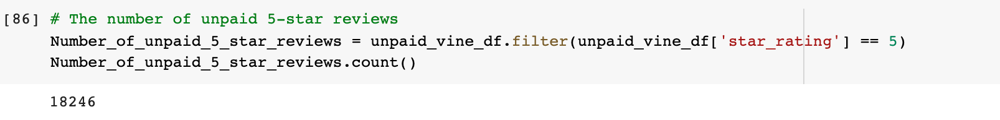
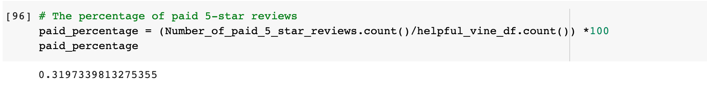
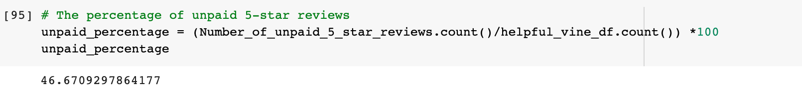

# Amazon_Vine_Analysis

## Purpose:

We are to analyze Amazon reviews written by paid Amazon Vine program members. The Amazon Vine program is a service that allows manufacturers and publishers to receive reviews for their products. We need to pick one of these datasets and use PySpark to perform the ETL process to extract the dataset, transform the data, connect to an AWS RDS instance, and load the transformed data into pgAdmin. Using PySpark, Pandas, or SQL, we need to determine if there is any bias towards favorable reviews from Vine members in your dataset.

## Results:

- How many Vine reviews and non-Vine reviews were there?
They are 266 Vines reviews and 38,829 non-Vine reviews, a total of 39,095 reviews.

- How many Vine reviews were 5-stars? How many non-Vine reviews were 5-stars?
They are  125 Vine reviews that were 5-stars.

There are 18,246 non-Vine reviews that were 5-stars.

- What percentage of Vine reviews were 5-stars?
The percentage of Vine reviews were 5 stars was 31.9%

- What percentage of non-Vine reviews were 5-stars?
The percentage of non-Vine reviews was 5-stars was 46.7%.

## Summary:
There is no evidence that there is a positivity bias for reviews in the Vine program. The percentage of paid 5-star reviews (31.9%) is lower than the percentage of unpaid 5-star reviews (46.7%). One additional analysis I would recommend would to implement other stars reviews for a better analysis.